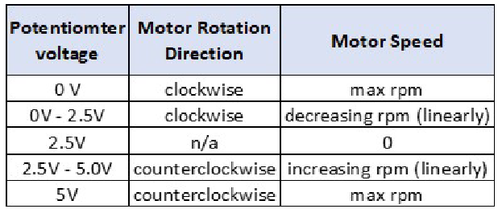

# **ECE 372 Lab 4 Project Description**
## Group Members
- Alan Manuel Loreto Cornídez
- Jeremy Sharp
- Jason Freeman

# Description
In this lab, you will control the speed and rotation of a dc motor using PWM signals, a potentiometer and the L293D driver chip included in your kit. The code provided is minimal.

# Instructions 
- First, you will need to be able to capture an analog voltage from a potentiometer that can vary from 0V to ~5V.
- The digital value captured from the potentiometer will control the duty cycle of the PWM signal that controls the speed of the motor.
- This PWM output will be connected to the L293D amplifier and this amplifier will connect to either side of the motor. See the L293D datasheet for details on connection to motor for bi-directional rotation.
- You will use one motor. The potentiometer will control both the direction and speed of the motor according to the table below.

<div align="center"></div>


- You will turn motor off by pressing a debounced switch using an
external interrupt (INT). The motor will remain off while a one-
digit seven segment display counts down from 9 to 0 seconds.
After reaching zero the seven segment display will go off and the
motor will be reactivated. During the time the display is
counting down, the push button interrupt should be disabled and
re-enabled when finished counting down

# Requirements
## Overall
1. Code must be readable and well commented.
2. Every file must contain code related to a single device. For example,the ADC and PWM code must be separated. The main function is an exception.
3. There are no non-trivial SFR manipulations in the main function and are wrapped in functions that have meaningful names
4. A state machine is used to implement the bulk of the functionality
of the program


## ADC
1. A function exists to initialize the ADC
2. Uses the A0 pin as an input

## PWM
1. Uses a PWMs on timer 3 and timer 4.
- Physical header pins 5 and 6 should be used. Pin 5 relates
to timer 3 and pin 6 relates to timer 4.
- Note: You will need to demo your PWM signal coming from
timer 3 using the digital storage oscilloscope in the lab.
2. Has a ```changeDutyCycle``` function
- The ```changeDutyCycle``` function takes in an argument which is the
combination of the analog to digital conversion, ADCH and ADCL registers.
- The result of the combination of the ADCH and ADCL registers is a 10-bit number.
- From this you will edit the OCRnA registers for the two 10-bit PWM timers used for the lab. 
- Editing the OCRnA register changes the duty cycle of the PWM signal.

## Timer
1. Uses a timer 0 to debounce states. Timer 1 to count 10 seconds for
the seven segment display.

## Seven Segment display
- Use PORTC pins as outputs to drive the seven segment display
configured in a common cathode mode.

## Switch
1. Uses a switch to turn the motor off.
2. The external interrupt must be of the type INTn (not PCINT) that
is used for switch debouncing. The interrupt sense control should
be configured for any logical change on INTn generates an
interrupt request.
3. PORTD0 should be used for this external interrupt.
4. The external interrupt should not work while the timer and seven
segment display is counting down from 9 secs to 0.

## Demo of Lab 4
Demonstrate your results to your TA including the PWM measurement on the Oscilloscope. All members should be present for the demonstration.

## Extra Credit:
For extra credit worth 15 points, use the shift register provided in
your kit to drive the seven segment display instead of using PORTC
pins directly. Create you own function to serially shift the data
into the shift register and drive the seven segment display.

## See the following link.
Note this link shows a common anode configuration which is different than your lab requirement:
https://www.electronicwings.com/arduino/7-segment-display-
interfacing-with-arduino-uno


