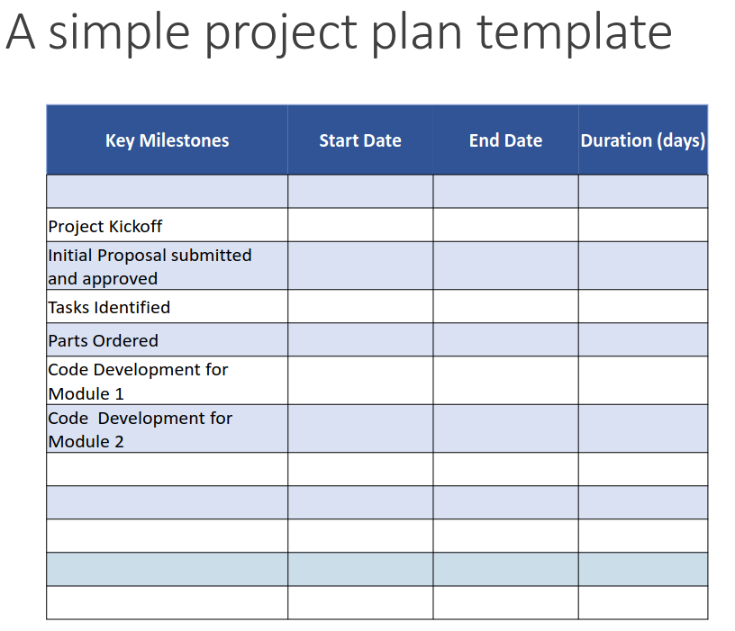

# **ECE 372 Final Project | Audio Visualization **
## Group Members
- Jason Freeman
- Alan Manuel Loreto Cornídez
- Jeremy Sharp

## Project Requirments

- Must state the problem you are trying to solve.
- Must propose your solution to the problem.
- Must define 4 requirements of the solution that you will use to determine the level of your success (using a rubric).
- You will determine your criteria to grade your performance (rubric) for each
requirement.
- Requirements must have measurable outcomes.
- Project must include one input sensor minimum.
- Sensor measurement(s) must control an output device.
- Serial communication must be implemented.  (sensor device or output
device). Use I2C, SPI or RS232 serial communication protocol.
- Initial project proposal must be submitted and approved.
- Well documented source code including all functions that you write.
- Must use original source code for all functions.  (Note:  Using built-in librariesrequires instructor preapproval).
- Your rubric must be evaluated at end of project.
- You will demo and present project as a group at the end of the project.

## Project Timeline
- Form groups (3 to 4 people) - Oct 31
- Submit initial project proposal – Nov. 8
- Initial Proposal submission Requirements are listed in subsequent slides.
- Approval by instructor – Nov 11
- Develop tasks and timeline for your project (project plan).
- Execute project plan and track status. (update plan if necessary).
- Demo of project as a group will occur at your last lab date.
- Presentation of project as a group will be during assigned final exam date.
- Code and presentation including any revisions are due in D2L by the last day of final at noon.

## Be sure to include the following in your final presentation

### Power requirements
Estimate how much power is needed. If it is battery operated estimate the battery life.

## A mechanical diagram  
How will your system be packaged and integrated into your system application? A conceptual diagram showing your ideas on what your prototype would look like will suffice. See final presentation slide for details.

## Sample Project Plan Template

